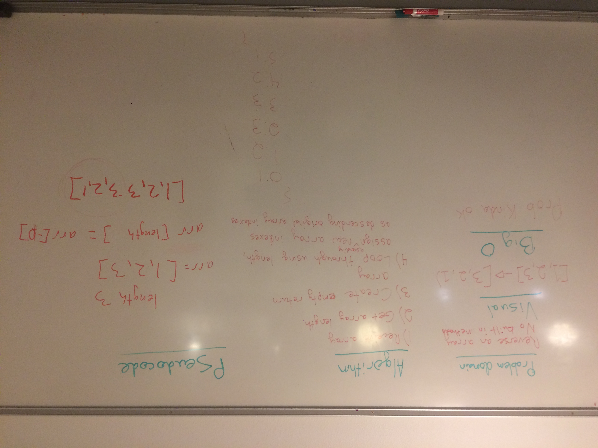

# Reverse an Array
Function should reverse an array, so `[1, 2, 3]` becomes `[3, 2, 1]`

## Challenge
Write a function called `reverseArray` which takes an array as an argument. Without utilizing any of the built-in methods available to your language, return an array with elements in reversed order.

## Approach & Efficiency
In the first function we took the approach of creating a different array to return, while in the second we took the approach of mutating the original array to return. I don't think I know enough about efficiency to know which is better, but I would lean towards the first method so that we are not mutating an array.

## Solution
