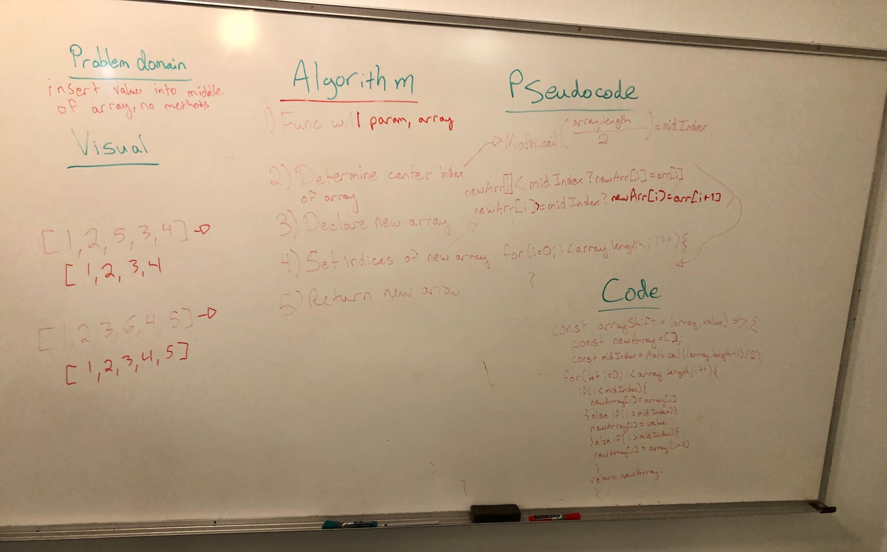

# Array shift
Function should place a value into the middle of an array
`[2,4,6,8], 5` -> `[2,4,5,6,8]`
`[4,8,15,23,42], 16` -> `[4,8,15,16,23,42]`

## Challenge
Write a function called `insertShiftArray` which takes in an array and the value to be added. Without utilizing any of the built-in methods available to your language, return an array with the new value added at the middle index.

## Stretch goal
Once you’ve achieved a working solution, write a second function that removes an element from the middle index and shifts other elements in the array to fill the new gap.

## Approach & Efficiency
For both problems (challenge and stretch) we created a new array to return. On the insertion function we used Math.ceil to find the halfway point, but in the removal function we had to use Math.floor to find the halfway point. We also had to take into account the difference in array lengths, being that the returned array would be either one longer or one shorter than the original array. We then used conditionals based on the index of the loop and the midIndex of the array to assign the values of each index of the return array.

## Solution

