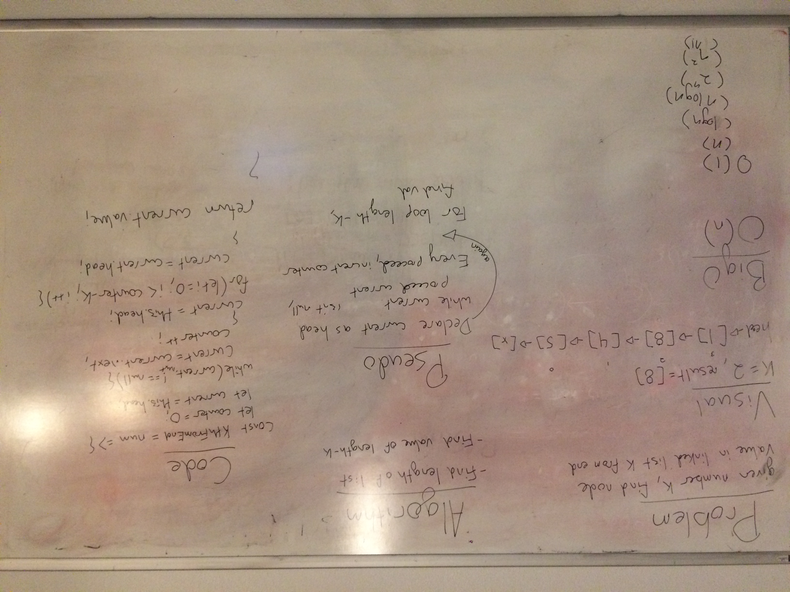

# Challenge summary
Write a method to get the value of a node kth from the end of a linked list.

## Challenge description
Write a method for the Linked List class which takes a number, k, as a parameter. Return the node’s value that is k from the end of the linked list. You have access to the Node class and all the properties on the Linked List class as well as the methods created in previous challenges.

## Approach & Efficiency
To solve this I found the length of the list and used that number as a basis of the for loop that will be used to find the requested value.

## Solution

## Example whiteboard layout
https://codefellows.github.io/common_curriculum/data_structures_and_algorithms/Whiteboard_Workflow.html