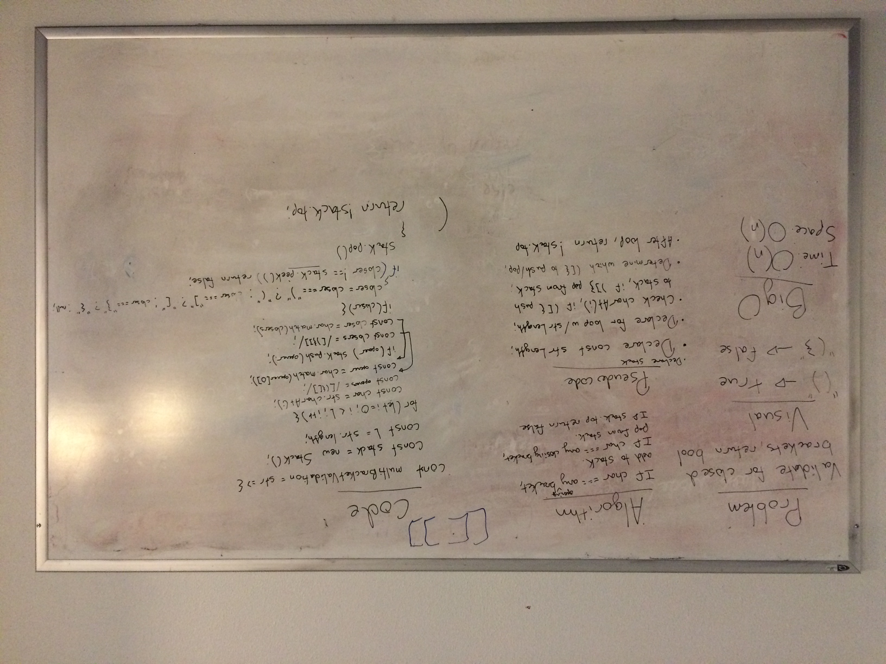

# Challenge summary
Your function should take a string as its only argument, and should return a boolean representing whether or not the brackets in the string are balanced. There are 3 types of brackets:

Round Brackets : ()
Square Brackets : []
Curly Brackets : {}

## Challenge description
On your main file, create…
C#: a method called public static bool MultiBracketValidation(string input)
JavaScript: a function called multiBracketValidation(input)
Python: a function called multi_bracket_validation(input)
Java: a method public static boolean multiBracketValidation(String input)
Your function should take a string as its only argument, and should return a boolean representing whether or not the brackets in the string are balanced. There are 3 types of brackets:

Round Brackets : ()
Square Brackets : []
Curly Brackets : {}

## Approach & Efficiency
We used a for loop based on the length of the input to check each character of the input string. If the input matched a regex pattern looking for bracket characters we either pushed to the stack or popped from the stack. Big O is O(n) because we have to go through each character of the input and could theoretically be pushing every item to the stack.

## Solution

## Example whiteboard layout
https://codefellows.github.io/common_curriculum/data_structures_and_algorithms/Whiteboard_Workflow.html