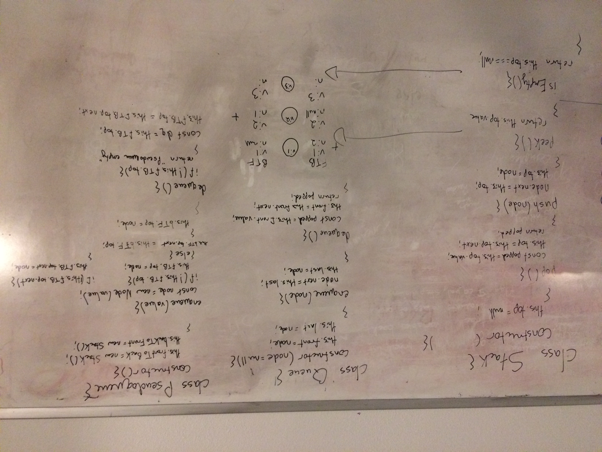

# Challenge summary
Create a Pseudoqueue class out of two Stack objects

## Challenge description
Create a brand new PseudoQueue class. Do not use an existing Queue. Instead, this PseudoQueue class will implement our standard queue interface (the two methods listed below), but will internally only utilize 2 Stack objects. Ensure that you create your class with the following methods:

enqueue(value) which inserts value into the PseudoQueue, using a first-in, first-out approach.
dequeue() which extracts a value from the PseudoQueue, using a first-in, first-out approach.
The Stack instances have only push, pop, and peek methods. You should use your own Stack implementation. Instantiate these Stack objects in your PseudoQueue constructor.

## Approach & Efficiency
At first I tried having one stack keep track of front to back and the other keep track of back to front, but I realized that I needed to use a "stacking ring" strategy of having one stack be the queue itself, but whenever we needed to dequeue we would transfer (inverse) stack 1 onto stack 2, then take off the head (first in of stack 1) and then transfer the stack back to stack 1.

## Solution

## Example whiteboard layout
https://codefellows.github.io/common_curriculum/data_structures_and_algorithms/Whiteboard_Workflow.html